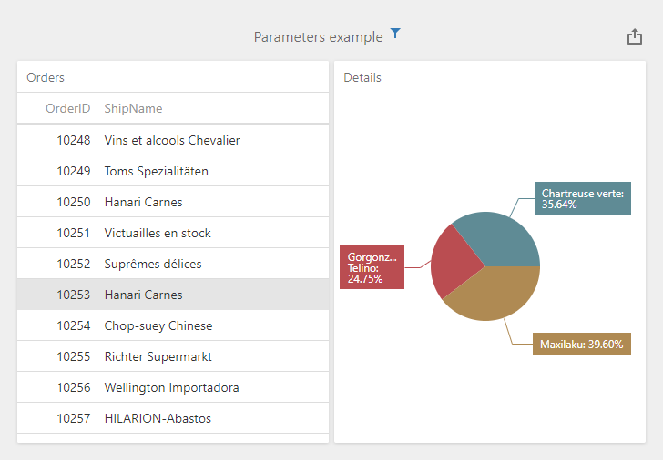
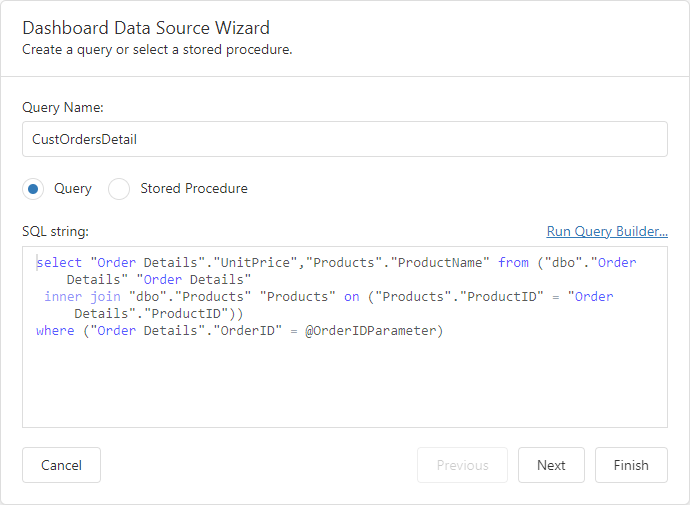

<!-- default badges list -->

[](https://supportcenter.devexpress.com/ticket/details/T1121967)
[](https://docs.devexpress.com/GeneralInformation/403183)
[](#does-this-example-address-your-development-requirementsobjectives)
<!-- default badges end -->
# Dashboard for ASP.NET Core - How to update the parameter value when the item's master filter state is changed

This example illustrates how to pass master filter values to a hidden dashboard parameter. 



The **Orders** grid item is bound to the **Orders** data source, and the **Details** pie item is bound to the **CustOrdersDetail** data source. The grid's master filter values are passed to the **OrderID** dashboard parameter that is used to [filter](https://docs.devexpress.com/Dashboard/117192) the **CustOrdersDetail** data source (the **OrderIDParameter** query parameter is mapped to the **OrderID** dashboard parameter):



The [ViewerApiExtensionOptions.onItemMasterFilterStateChanged](https://docs.devexpress.com/Dashboard/js-DevExpress.Dashboard.ViewerApiExtensionOptions?p=netframework#js_devexpress_dashboard_viewerapiextensionoptions_onitemmasterfilterstatechanged) event handler obtains changed master filter values. The [DashboardParameterDialogExtension.getParameters](https://docs.devexpress.com/Dashboard/js-DevExpress.Dashboard.DashboardParameterDialogExtension?p=netframework#js_devexpress_dashboard_dashboardparameterdialogextension_getparameters) method obtains the dashboard parameters. The [DashboardParameter.setValue](https://docs.devexpress.com/Dashboard/js-DevExpress.Dashboard.DashboardParameter#js_devexpress_dashboard_dashboardparameter_setvalue_value_) method passes master filter's values to the **OrderID** dashboard parameter:

```js
var dashboardControl;

function onBeforeRender(s, e) {
	dashboardControl = s.GetDashboardControl();
	var viewerApiExtension = dashboardControl.findExtension('viewerApi');
	if (viewerApiExtension)
		viewerApiExtension.on('itemMasterFilterStateChanged', onItemMasterFilterStateChanged);
}
function onItemMasterFilterStateChanged(e) {
	if (e.itemName == "gridDashboardItem1") {
		var dashboardParameterDialogExtension = dashboardControl.findExtension('dashboardParameterDialog');
		var parameters = dashboardParameterDialogExtension.getParameters();
		var parameter1 = parameters.getParameterByName("OrderID");
		parameter1.setValue(e.values[0][0]);
	}
}
```

The default master filter and dashboard parameter values are specified in the [dashboard state](https://docs.devexpress.com/Dashboard/118733/web-dashboard/aspnet-web-forms-dashboard-control/manage-dashboard-state).

## Files to Review

- [Script.js](./CS/AspNetCoreDashboard/wwwroot/js/Script.js) 
- [Index.cshtml](./CS/AspNetCoreDashboard/Pages/Index.cshtml)
- [DashboardUtils.cs](./CS/AspNetCoreDashboard/Code/DashboardUtils.cs)

## Documentation

- [Extensions Overview](https://docs.devexpress.com/Dashboard/117543/web-dashboard/ui-elements-and-customization/extensions-overview)
- [Manage Dashboard State in ASP.NET Core Applications](https://docs.devexpress.com/Dashboard/119997/web-dashboard/aspnet-core-dashboard-control/manage-dashboard-state)

## More Examples

- [Dashboard for Web Forms - How to update the dashboard parameter value when the item's master filter state is changed](https://github.com/DevExpress-Examples/web-forms-dashboard-update-parameter-master-filter-changed)
- [Dashboard for ASP.NET Core - How to specify a default dashboard state in code](https://github.com/DevExpress-Examples/aspnet-core-dashboard-specify-default-state-in-code)
- [Dashboard for ASP.NET Core - How to specify dashboard parameter values on the client side](https://github.com/DevExpress-Examples/asp-net-core-dashboard-specify-dashboard-parameter-values-on-the-client)
<!-- feedback -->
## Does this example address your development requirements/objectives?

[](https://www.devexpress.com/support/examples/survey.xml?utm_source=github&utm_campaign=asp-net-core-dashboard-update-parameter-master-filter-changed&~~~was_helpful=yes) [](https://www.devexpress.com/support/examples/survey.xml?utm_source=github&utm_campaign=asp-net-core-dashboard-update-parameter-master-filter-changed&~~~was_helpful=no)

(you will be redirected to DevExpress.com to submit your response)
<!-- feedback end -->
